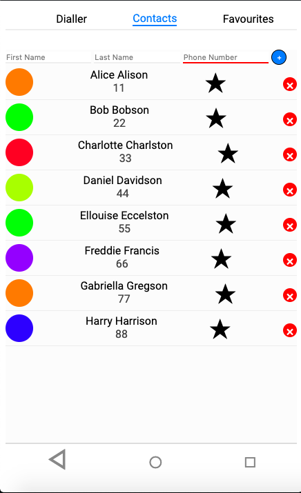
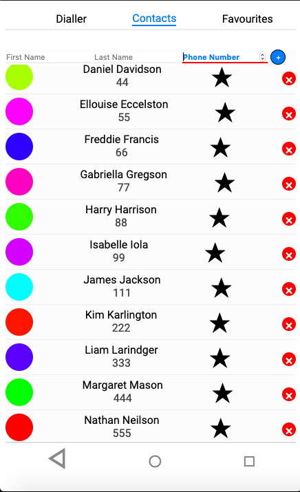
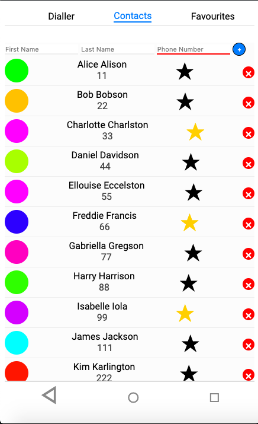
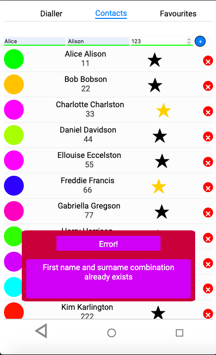
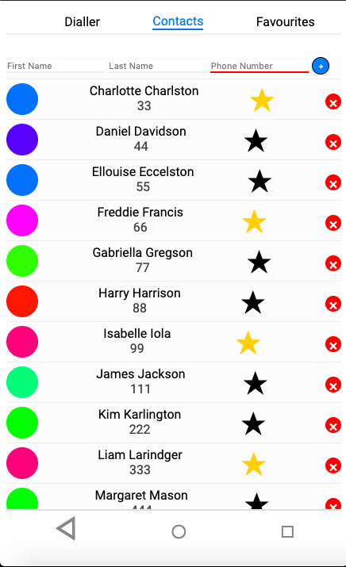
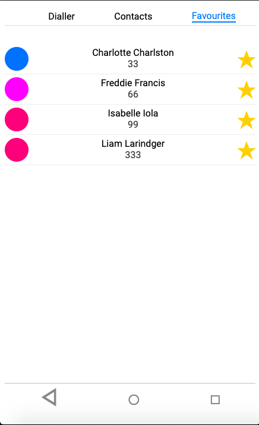
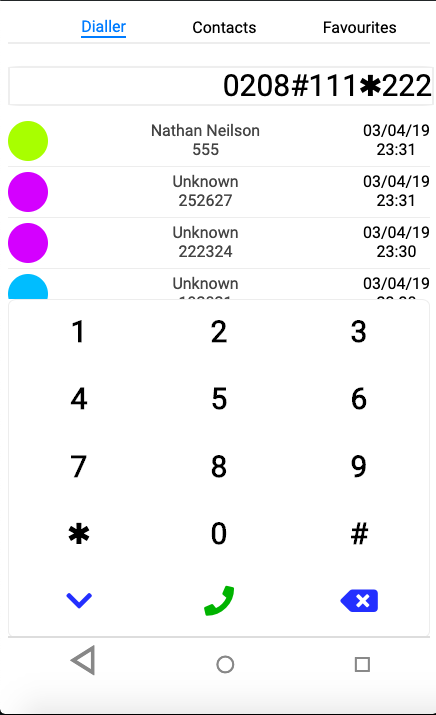
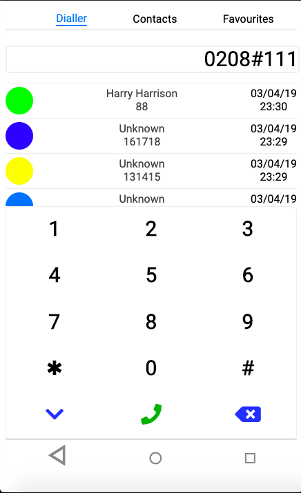
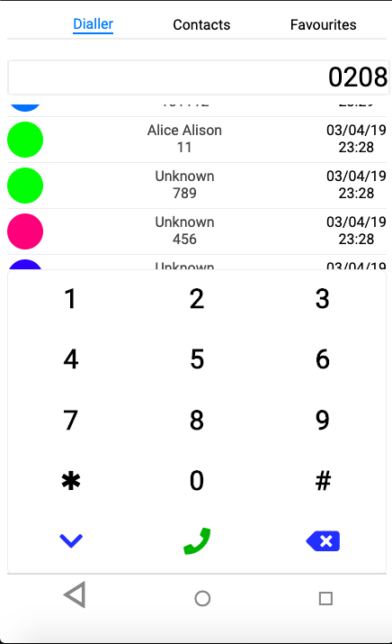

# Phone Application

### How To Open
> 1. Go to the folder downloaded from the project
> 2. Right click on the file named _index.html_
> 3. Choose the _open with_ option
> 4. Open the file in your preferred browser

### How To Use
- Dialler
	- Use dialler pad to enter or remove a number
	- Use call icon to be redirected to the device's phone app with that number
- Contacts
	- Fill in the desired contacts details
	- Press the _+_ icon to add the contact
	- Press a contact's star icon to add it to the favourites section
	- Press a contact's cross icon to remove the contact
	- Contacts that have been added to the favourites section cannot be removed
- Favourites
	- This is a list of all contacts the have been favourited in alphabetical order (ascending)
	
### Requirements
> 1. This projects requires a browser to run
> 2. The browser must have Javascript available and enabled

### Known Errors
- Logical
	1. Error in contact adding logic: If I add a contact with the first name "Alice" and the surname "Bobson" then I add a contact with the first name "Bobson" and the surname "Alice", I cannot the contact "Alice Alice" or "Bobson Bobson"
- Semantic
	1. The lists of contacts/callees should preferably have the avatar to the very left (done), the name and number to the very left immadiately after the avatar (those are currently in the center/left center) and all other information to the very right (done for the dialler/favourites section, the stars in the contacts section are on the right center)
- Syntax
	- N/A

### Extensions
> 1. If you call a number that does not exist then add that number to the contacts and call it again update the list of callees so that the name of the contact replaces the default "Unknown" for both times the number was called
> 2. If you click on the down chevron in the dialler section the dialler pad minimizes
> 3. Add local storage so the list of callees, contacts, favourites etc. remains even once the application is closed

### Preview

